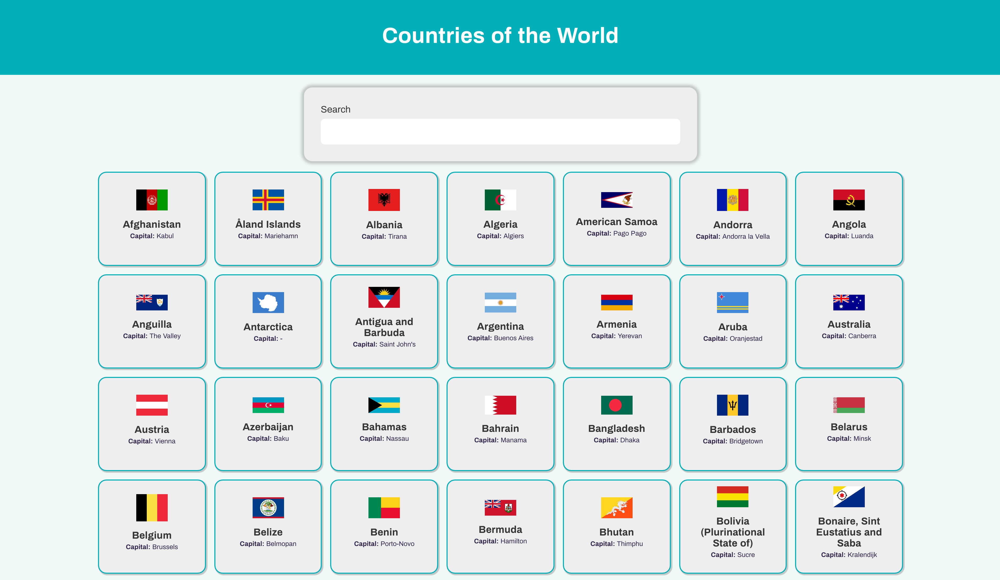
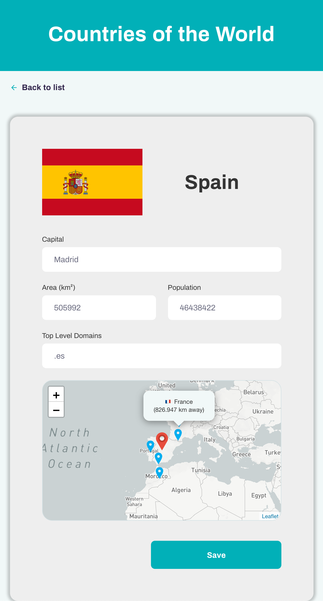

  
    
  

<h1 align="center">Countries of the World</h1>

Projeto <strong>Countries of the World</strong>, desenvolvido em React.

A aplicação está publicada e pode ser testada no endereço https://wcountries.netlify.app/ e permite visualizar a lista de países do mundo, utilizando a API <a href="https://github.com/lennertVanSever/graphcountries">Graph Countries</a>.

## Funcionalidades

Esse projeto possui as seguintes funcionalidades:

- Exibir a lista de países do mundo
- Buscar países na lista
- Visualizar detalhes do país
- Editar detalhes do país (a edição é aplicada somente no client-side)
- Visualizar a localização do país em um mapa, assim como a dos 5 países mais próximos dele, exibindo a distância deles do país selecionado

## Instalação e execução

_ps: Se precisar de ajuda para fazer um clone, esse [tutorial aqui](https://help.github.com/pt/github/creating-cloning-and-archiving-repositories/cloning-a-repository) vai te ajudar 💖_

1. Abra o terminal do seu computador. Se estiver no Windows pode ser o CMD ou Powershell;
2. Altere o diretório de trabalho atual para o local em que deseja ter o código da aplicação salvo no seu computador;
3. Faça um clone desse repositório rodando:   `git clone https://github.com/jean-ross/countries-info.git`;
4. Entre na pasta rodando pelo terminal: `cd countries-info`;
5. Crie uma cópia do arquivo `.env.example` com o nome `.env`, na mesma pasta do arquivo de origem;
6. Abra o arquivo `.env` e configure o valor da variável de ambiente `REACT_APP_MAPBOX_TOKEN=` com um token válido da API do [Mapbox](https://www.mapbox.com/) (criado gratuitamente);
7. Rode `yarn` para instalar as dependências do projeto;
8. Rode `yarn start` para iniciar o servidor de desenvolvimento.

## :memo: Licença

Esse projeto está sob a licença MIT.

---

Feito com ♥ by Jean Ross :wave:
